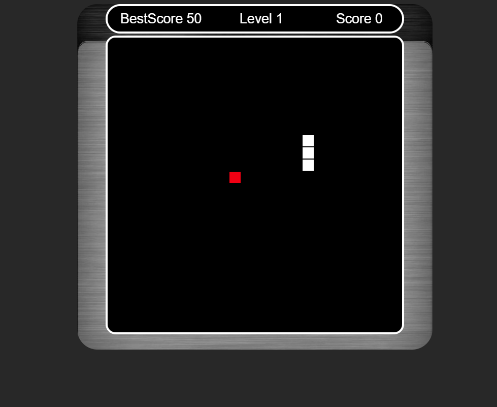
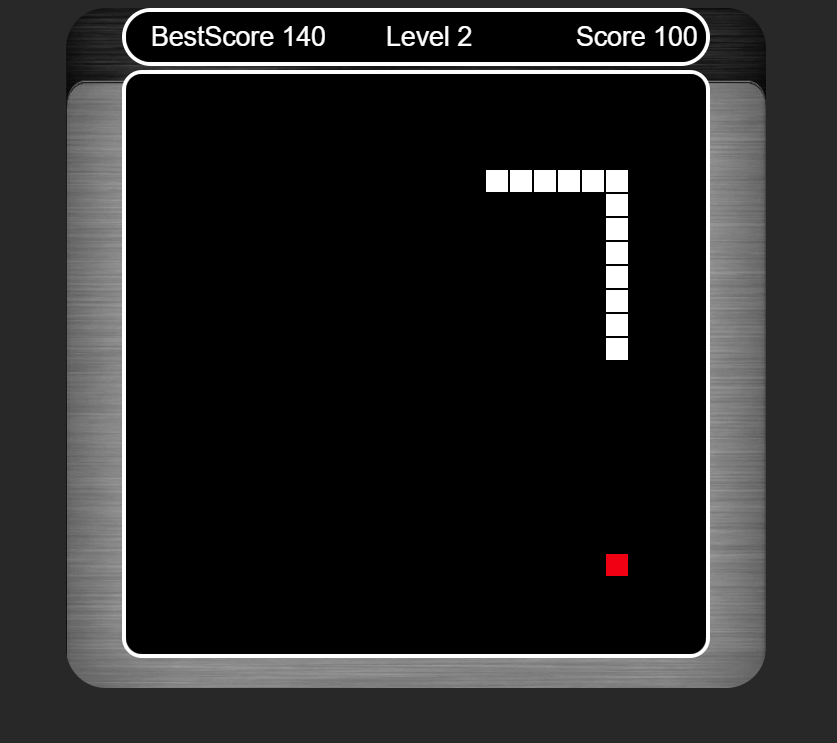

# simple js snake game
 
simple javascript snake game

## Gameplay and Controls

The player controls a square, or object on a bordered plane. As it moves forward, 
it leaves a trail behind, resembling a moving snake. The player loses when the snake runs into 
the screen border, a trail or other obstacle, or itself.
The snake can be moved either with arrow buttons or w,a,s,d buttons from the keyboard.

## 📝 License

The project is available as open source under the terms of the MIT License.

- **[MIT license](http://opensource.org/licenses/mit-license.php)**
- Copyright 2020 © <a href="http://fvcproductions.com" target="_blank">NasosG</a>.