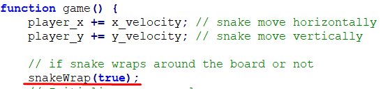
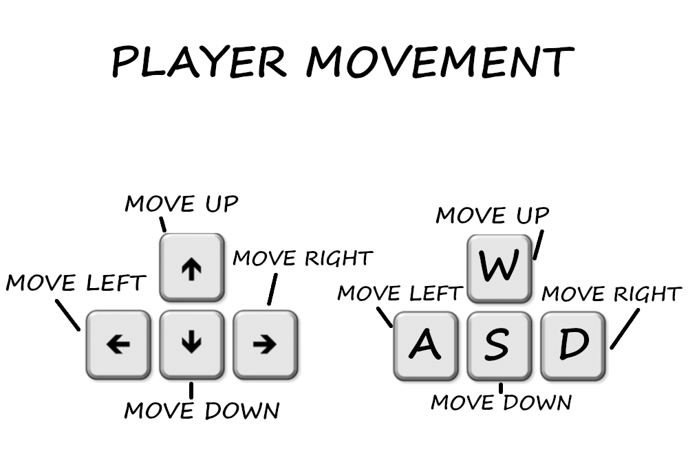

# simple JS snake game
 
This is a simple JavaScript snake game. Some simple canvases have been created at snake.html. The whole functionality
is implemented at snake.js where the initialisation and movement of the snake has been implemented, the food spawn after
checking that there are no collisions e.t.c. Finally, you can check or change the simple ( but beautiful, I think :> ) 
design of the project (snake.css). 

## Screenshots

### Screenshot showing the game as it has progressed a bit and player is at level 2 controlling a bigger snake

### Screenshot showing the snake at the beginning of the game

## Gameplay and Controls

The player controls a square snake on a bordered plane. As it moves forward, it leaves a trail behind, resembling a moving snake. 
The player loses when the snake runs into itself (its tail). 
In this version snake wraps around the board. In order for the player to lose when the snake runs into the screen border,
you can change snake.js code. Go to game function and change snakeWrap(true) to snakeWrap(false). You can of course make any other changes you like.
 

 

### The snake can be moved either with arrow buttons or w,a,s,d buttons from the keyboard.

## 📝 License

The project is available as open source under the terms of the MIT License.

- **[MIT license](http://opensource.org/licenses/mit-license.php)**
- Copyright 2020 © <a href="http://fvcproductions.com" target="_blank">NasosG</a>.